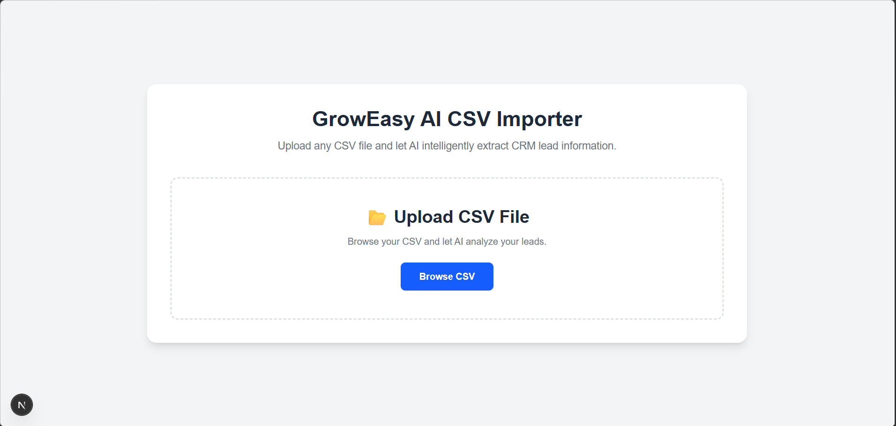
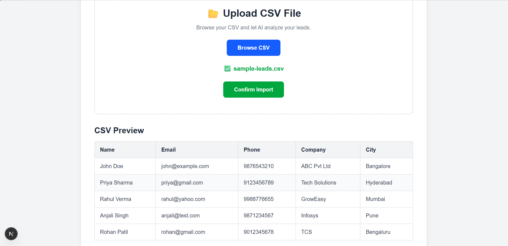
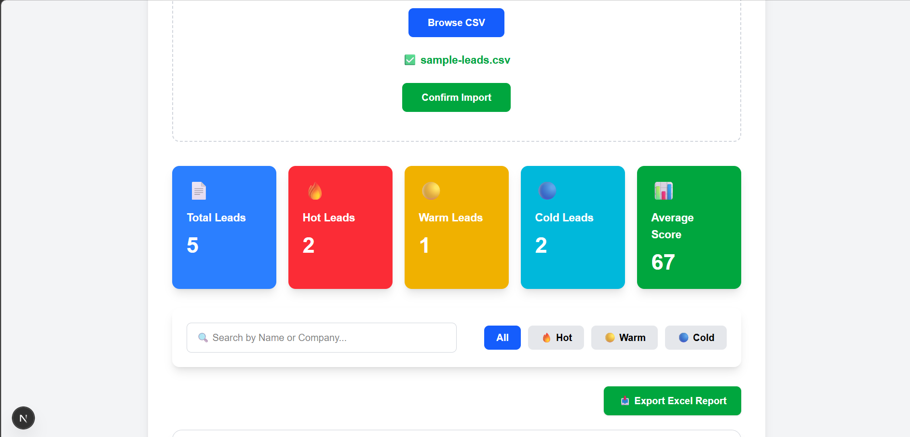
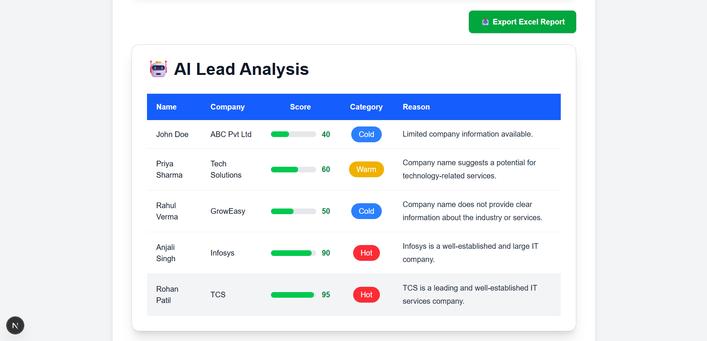
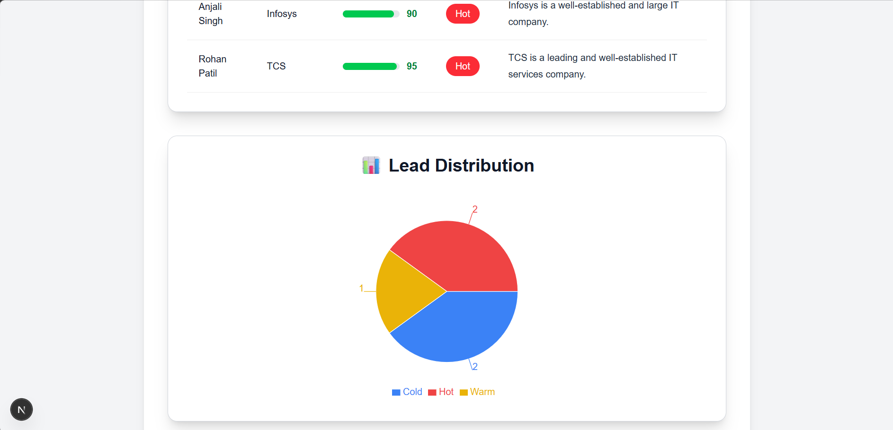
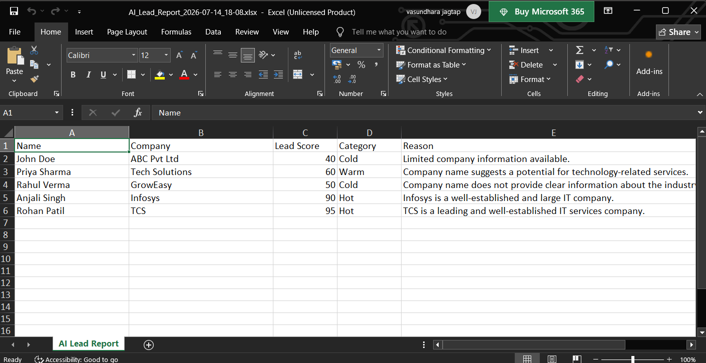

# 🚀 GrowEasy AI CRM Lead Analyzer

An AI-powered CRM Lead Analysis application that allows users to upload CSV files, automatically analyze leads using AI, classify them into Hot, Warm, and Cold categories, visualize lead distribution, and export the analyzed results into Excel.

---

## ✨ Features

- 📂 Upload any CRM Lead CSV file
- 🤖 AI-powered Lead Analysis using Groq Llama 3.3 70B
- 🔥 Automatic Lead Scoring (0–100)
- 🟢 Hot, 🟡 Warm & 🔵 Cold Lead Classification
- 📊 Interactive Dashboard
- 🥧 Lead Distribution Pie Chart
- 🔍 Search and Filter Leads
- 📄 Export AI Results to Excel (.xlsx)
- ⚡ Batch Processing for Large CSV Files
- 📱 Responsive User Interface

---

# 🛠 Tech Stack

### Frontend
- Next.js
- React
- TypeScript
- Tailwind CSS
- Axios
- PapaParse
- Recharts
- XLSX

### Backend
- Node.js
- Express.js
- CORS
- Dotenv

### AI
- Groq API
- Llama 3.3 70B Versatile

### Tools
- Git
- GitHub
- VS Code

---

# 📂 Project Structure

```
groweasy-ai-csv-importer
│
├── backend
│   ├── server.js
│   ├── package.json
│   └── ...
│
├── frontend
│   ├── app
│   ├── components
│   ├── package.json
│   └── ...
│
├── sample-data
│   ├── sample-leads.csv
│   ├── mixed-quality-leads.csv
│   └── crm-leads-100.csv
│
├── screenshots
│   ├── home-page.png
│   ├── csv-upload.png
│   ├── dashboard.png
│   ├── ai-analysis.png
│   ├── lead-distribution.png
│   └── excel-report.png
│
└── README.md
```

---

# 📸 Project Screenshots

## 🏠 Home Page



---

## 📂 CSV Upload



---

## 📊 Dashboard



---

## 🤖 AI Lead Analysis



---

## 📈 Lead Distribution



---

## 📄 Excel Export



---

# ⚙ Installation

## Clone the Repository

```bash
git clone https://github.com/vasundhara2509/groweasy-ai-csv-importer.git
```

---

## Backend Setup

```bash
cd backend
npm install
```

Create a `.env` file inside the backend folder.

```env
GROQ_API_KEY=YOUR_GROQ_API_KEY
PORT=5000
```

Run the backend server.

```bash
node server.js
```

---

## Frontend Setup

```bash
cd frontend
npm install
npm run dev
```

Open the application in your browser.

```
http://localhost:3000
```

---

# 🤖 AI Workflow

1. Upload a CSV file containing CRM lead data.
2. Parse the CSV using PapaParse.
3. Send the lead data to the Express backend.
4. Backend forwards the data to the Groq AI API.
5. AI generates:
   - Lead Score
   - Category (Hot, Warm, Cold)
   - Reason for the score
6. Display the analyzed data in a dashboard.
7. Export the final analysis as an Excel report.

---

# 📊 Sample Dataset

The repository includes sample CSV files for testing.

- sample-leads.csv
- mixed-quality-leads.csv
- crm-leads-100.csv

---

# 🔮 Future Enhancements

- User Authentication
- Upload History
- PDF Report Export
- AI Summary Report
- Multiple Dashboard Charts
- Database Integration
- Cloud Deployment
- Real-time Analytics

---

## 👩‍💻 Author

**Vasundhara Jagtap**

- GitHub: https://github.com/vasundhara2509
- Built as a Full Stack AI-powered CRM Lead Analysis project using Next.js, Express.js, and Groq AI.